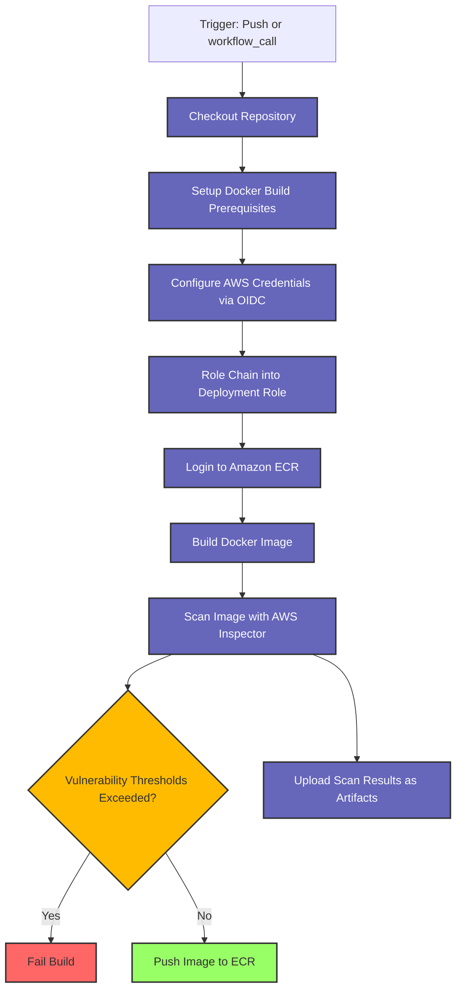

# Docker ECR GitHub Action with AWS Inspector Scanner

This repository demonstrates how to implement a GitHub Action workflow that builds Docker images, scans them for vulnerabilities using AWS Inspector, and pushes them to Amazon ECR if they meet security requirements.

## Features

- **Security Scanning**: Automatically scans Docker images using AWS Inspector before pushing to ECR
- **Configurable Vulnerability Thresholds**: Customizable thresholds for different severity levels
- **Build Failure Enforcement**: Automatically fails builds that don't meet security standards
- **SBOM Generation**: Creates and uploads a Software Bill of Materials (SBOM) as an artifact
- **AWS IAM Role Chaining**: Uses OIDC authentication with AWS for secure credential management

## How It Works

The workflow performs the following steps:

1. Checks out the repository code
2. Sets up Docker build prerequisites
3. Configures AWS credentials using OIDC authentication
4. Builds the Docker image (but doesn't push it yet)
5. Scans the built image with AWS Inspector
6. Uploads the scan results and SBOM as artifacts
7. Fails the job if vulnerability thresholds are exceeded
8. Pushes the image to ECR if it passes the security scan

## Workflow Diagram



## Vulnerability Thresholds

The workflow uses environment variables to define thresholds for different vulnerability severity levels:

```yaml
env:
  CRITICAL_THRESHOLD: 0  # No critical vulnerabilities allowed
  HIGH_THRESHOLD: 0      # No high vulnerabilities allowed
  MEDIUM_THRESHOLD: 5    # Up to 5 medium vulnerabilities allowed
  LOW_THRESHOLD: 5       # Up to 5 low vulnerabilities allowed
  OTHER_THRESHOLD: 5     # Up to 5 other vulnerabilities allowed
```

If the number of vulnerabilities exceeds any of these thresholds, the workflow will fail before pushing the image to ECR.

## Required GitHub Secrets

To use this workflow, you'll need to configure the following GitHub secrets:

| Secret Name | Description |
|-------------|-------------|
| `OICD_ROLE` | ARN of the AWS IAM role that can be assumed via OIDC for initial authentication |
| `DEPLOY_ROLE` | ARN of the AWS IAM role with permissions to push to ECR (role chaining) |

## Setting Up Required Secrets and Environment Variables

### 1. Create an OIDC Connection in AWS

First, set up GitHub Actions OIDC provider in AWS:

1. Go to the AWS IAM console
2. Navigate to "Identity providers" and select "Add provider"
3. Choose "OpenID Connect" as the provider type
4. Set the provider URL to `https://token.actions.githubusercontent.com`
5. Set the audience to `sts.amazonaws.com`
6. Verify and add the provider

### 2. Create IAM Roles

Create two IAM roles:

#### OIDC Role (used for `OICD_ROLE` secret)

Create a role with the following trust policy:

```json
{
  "Version": "2012-10-17",
  "Statement": [
    {
      "Effect": "Allow",
      "Principal": {
        "Federated": "arn:aws:iam::ACCOUNT_ID:oidc-provider/token.actions.githubusercontent.com"
      },
      "Action": "sts:AssumeRoleWithWebIdentity",
      "Condition": {
        "StringEquals": {
          "token.actions.githubusercontent.com:aud": "sts.amazonaws.com"
        },
        "StringLike": {
          "token.actions.githubusercontent.com:sub": "repo:YOUR_GITHUB_ORG/YOUR_REPO_NAME:*"
        }
      }
    }
  ]
}
```

Attach a policy with permissions to assume the deployment role.

#### Deployment Role (used for `DEPLOY_ROLE` secret)

Create another role with a trust policy allowing it to be assumed by the OIDC role:

```json
{
  "Version": "2012-10-17",
  "Statement": [
    {
      "Effect": "Allow",
      "Principal": {
        "AWS": "arn:aws:iam::ACCOUNT_ID:role/YOUR_OIDC_ROLE_NAME"
      },
      "Action": "sts:AssumeRole"
    }
  ]
}
```

Attach policies for:
- ECR repository access
- AWS Inspector scanning permissions

### 3. Store Role ARNs as GitHub Secrets

1. Go to your GitHub repository settings
2. Navigate to "Secrets and variables" → "Actions"
3. Add new repository secrets:
   - `OICD_ROLE`: The ARN of your OIDC role
   - `DEPLOY_ROLE`: The ARN of your deployment role

### 4. Configure Environment Variables

Update the following values in the workflow file:

```yaml
env:
  AWS_REGION: ap-southeast-2  # Change to your AWS region
  ECR_REPOSITORY: my-ecr-repo  # Change to your ECR repository name
  # Adjust vulnerability thresholds as needed
  CRITICAL_THRESHOLD: 0
  HIGH_THRESHOLD: 0
  MEDIUM_THRESHOLD: 5
  LOW_THRESHOLD: 5
  OTHER_THRESHOLD: 5
```

## Example Usage

To use this workflow in your project:

1. Copy the `.github/workflow/build-docker-image.yml` file to your repository
2. Configure the required secrets and environment variables
3. Create a Dockerfile in your repository root (see example below)
4. Trigger the workflow by pushing to your repository or manually running it

## Example Dockerfile

Below is an example Dockerfile with a multi-stage build that creates an nginx container with software updates:

```dockerfile
# Stage 1: Update base image and prepare files
FROM ubuntu:22.04 AS builder

# Update packages and install nginx
RUN apt-get update && \
    apt-get upgrade -y && \
    apt-get install -y nginx && \
    apt-get clean && \
    rm -rf /var/lib/apt/lists/*

# Create a custom index.html
RUN echo "<!DOCTYPE html><html><head><title>AWS Inspector Demo</title></head><body><h1>Docker Image Scanned with AWS Inspector</h1></body></html>" > /var/www/html/index.html

# Stage 2: Create the final nginx image
FROM nginx:stable-alpine

# Copy custom nginx configuration and content from builder
COPY --from=builder /var/www/html/index.html /usr/share/nginx/html/index.html

# Add build information
ARG GIT_SHA="unknown"
LABEL git_sha=$GIT_SHA

# Default command
CMD ["nginx", "-g", "daemon off;"]
```

## Security Considerations

- Regularly update base images to minimize vulnerabilities
- Use the principle of least privilege when configuring IAM roles
- Consider using distroless or minimal base images for smaller attack surfaces
- Review AWS Inspector scan results regularly and address identified vulnerabilities

## Troubleshooting

If the workflow fails due to vulnerability thresholds:

1. Review the scan results in the GitHub Actions artifacts
2. Address the vulnerabilities in your Dockerfile or dependencies
3. Consider adjusting thresholds temporarily if non-critical vulnerabilities cannot be immediately fixed

## License

[MIT License](LICENSE)